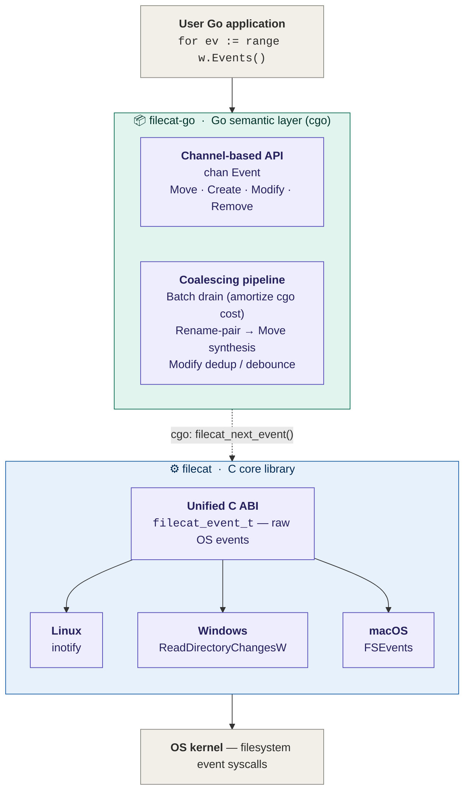

# filecat-go

> Go bindings + semantic layer for [**filecat**](https://github.com/lizzary/Filecat),
> a cross-platform recursive directory watcher.
>
> filecat (C core) handles OS-native recursive watching via inotify / 
> ReadDirectoryChangesW / FSEvents and emits raw events. This layer adds:
>
> - **Watchman-style batch pipelining** — drain events from the C core in
>   batches to amortize cgo call overhead
> - **Rename-pair coalescing** — fuse `Remove + Create` pairs (matched by
>   inotify cookie / Windows old-name+new-name / FSEvents rename flag) into
>   a single clean `Move` event
> - **Modify deduplication / debouncing** — collapse bursts of `Modify`
>   events on the same path into one
> - **Idiomatic Go API** — channel-based, context-cancellable, no callbacks

## Architecture



## Quick start

```go
package main

import (
    "context"
    "fmt"
    "github.com/lizzary/Filecat-go"
)

func main() {
    w, err := filecat.Open("/some/dir", filecat.Recursive)
    if err != nil { panic(err) }
    defer w.Close()

    ctx, cancel := context.WithCancel(context.Background())
    defer cancel()

    for ev := range w.Events(ctx) {
        fmt.Printf("%-8s %s\n", ev.Type, ev.Path)
        if ev.Type == filecat.Move {
            fmt.Printf("         from: %s\n", ev.OldPath)
        }
    }
}
```

## Relationship to filecat (C core)

This module vendors the C source under `internal/cbinding/` and builds it
through cgo — no separate install step. The C core's public API
(`filecat_open`, `filecat_next_event`, `filecat_close`) is wrapped by a
dedicated goroutine per watcher to keep cgo's goroutine-pinning contained,
and `ev.path` (watcher-owned, invalidated on next call) is copied across the
cgo boundary into Go-heap strings before being delivered to the channel.

For low-level details, build/test instructions, or to consume the C library
directly from C/C++, see [lizzary/Filecat](https://github.com/lizzary/Filecat).

## License

MIT
