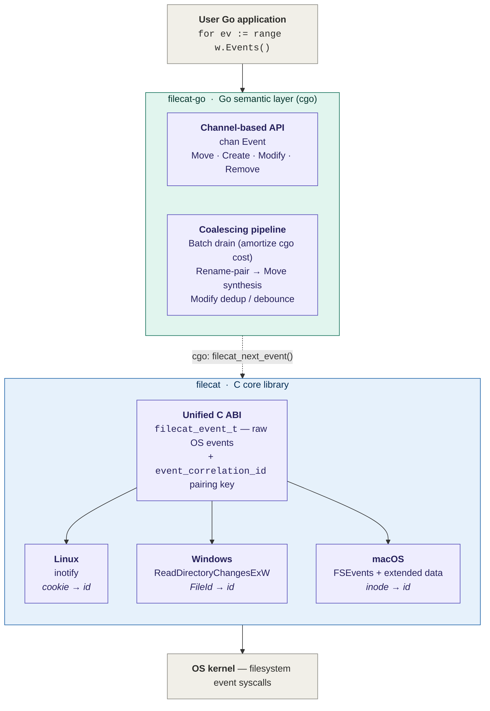

# filecat-go

[](https://pkg.go.dev/github.com/lizzary/filecat-go)
[](https://goreportcard.com/report/github.com/lizzary/filecat-go)
[](LICENSE)

> **Two-layer file watching stack** — filecat-go is the **Go semantic layer**:
> an idiomatic channel-based API on top of the [**Filecat**](https://github.com/lizzary/Filecat)
> C core, which does the cross-platform recursive watching. This module adds
> Watchman-style event coalescing, rename → `Move` synthesis, and modify
> debouncing via cgo.

A recursive directory watcher for Go with **near-zero cold-start cost**,
**near-zero per-directory memory**, and **system-fact-based** rename / move
reconstruction — no path caches, no inode-walk on startup, no heuristics.

```go
w, _ := filecat.NewWatcher("/some/dir", true, 256, 50*time.Millisecond)
defer w.Close()

for ev := range w.Events() {
    switch ev.Type {
    case filecat.EventMove:
        fmt.Printf("%s %s -> %s\n", ev.Type, ev.OldPath, ev.Path)
    default:
        fmt.Printf("%s %s\n", ev.Type, ev.Path)
    }
}
```

## Why filecat-go

Every Go file-watching library has the same shape underneath: it wraps
[`fsnotify`](https://github.com/fsnotify/fsnotify), or one of the
recursive forks of it, and pays the price that fsnotify itself
intentionally does not pay. There are two prices, and existing libraries
make you pay at least one of them — usually both.

### 1. Near-zero cold start, near-zero recursive-watch overhead

The recursive-watcher tax. `fsnotify` does not support recursive watching
on any platform, so every library above it walks the tree from Go at
startup and registers one watcher per directory. On a `node_modules`, a
monorepo, or a build cache, that means:

- **Seconds-to-minutes** of cold start before any event is delivered,
  while the goroutine walks the tree and issues N `inotify_add_watch`
  (Linux) or N handle-opens (Windows/macOS) syscalls.
- **Hundreds of MB to multiple GB of resident memory** for the Go-side
  `map[wd]string` (watch descriptor → absolute path), kept live for the
  GC for as long as the watcher exists.
- **Per-directory goroutine / channel plumbing** in some wrappers,
  multiplying the constant factor again.

filecat-go does **none** of that, because the C core does not. On
Windows, a single `ReadDirectoryChangesExW` handle with
`bWatchSubtree=TRUE` covers the entire subtree — **O(1) handles, O(1)
cold start**, measured at **66 µs for a 10 000-directory tree**. On
macOS, a single `FSEvents` stream covers the entire subtree — same
shape, same numbers. On Linux the kernel itself has no recursive mode
(no user-space library can change that), but the watch table is a flat
open-addressed hash map in C indexed by `wd` and holding *relative*
paths only — no Go runtime, no GC, no per-directory allocator churn.
**Still O(N) directories on Linux, but a much smaller N's worth, and no
Go-side mirror.**

### 2. Near-zero, non-heuristic rename / move reconstruction

The semantics tax. Even libraries that solve recursion still leak when
it comes to *what the user actually did*. A user `mv a b` is one logical
action; the OS surfaces it as two events with no shared identity, and
the user expects one `Move(a → b)` back. The usual workarounds:

- **Path-keyed caches.** Stat every file in the tree at startup, store
  `path → FileID`, and pair `REMOVED + CREATED` events by looking the
  old path up. This means the *cold-start* cost above is doubled (you
  walk the tree twice — once to install watches, once to stat for
  FileIDs), and the resident map grows with file count, not just
  directory count.
- **Time / proximity heuristics.** "If a `REMOVED` and a `CREATED`
  happen within X ms with similar names, call it a Move." This is what
  most cross-platform watchers do; it is wrong under load, wrong across
  subdirectories, and silently wrong when the kernel reuses an inode.

filecat-go does neither. The Filecat C core attaches an
`event_correlation_id` to every event, populated from **whatever native
identity the kernel actually surfaces**:

| OS      | Identity surfaced by the kernel                                         |
|---------|--------------------------------------------------------------------------|
| Linux   | inotify rename cookie (non-zero on `RENAMED_OLD` / `RENAMED_NEW`)        |
| Windows | NTFS / ReFS `FileId` from `FILE_NOTIFY_EXTENDED_INFORMATION` (every event) |
| macOS   | FSEvents extended-data inode, 10.13+ (every event)                       |

Two events with the same non-zero id refer to the same logical file or
rename. *That one rule covers all three platforms* — it is the system's
own answer, not a guess. filecat-go's coalescer (`coalesce.go`) is a
single hash map keyed on that id; rename pairs collapse into `Move`,
cross-subdirectory `REMOVED + CREATED` pairs (with a shared `FileId` on
Windows / inode on macOS) collapse into `Move`, half-moves into and out
of the watched tree degrade gracefully to `Created` / `Removed`. No
path-keyed cache, no inode walk, no heuristic — and the Go-side state
lives only for the duration of one settle window (default 50 ms), not
for the lifetime of the watcher.

### 3. Watchman-style settle window, in Go

The event-stream processing model is borrowed from Facebook's
[Watchman](https://facebook.github.io/watchman/): instead of forwarding
every kernel event raw, the coalescer collects events for a short
"settle window" and emits a deduplicated batch. Within one window:

- Rename / move halves are paired by `event_correlation_id` and emitted
  as a single `Move` event.
- Repeat `MODIFIED` for the same path collapse to one event — directly
  absorbing the Windows write storm, where a single `fwrite` typically
  produces three or more `MODIFIED` events (size, last-write, attrs).
- The window is **not** reset on subsequent events, so a steady stream
  cannot starve a flush — the timer fires once per batch on its original
  deadline.

The window is your knob: **smaller = lower latency, more spurious
events; larger = more coalescing, more wait**. 50 ms is the Watchman
default and the right starting point for interactive tooling.

### What you give up

This is a cgo module. You get a C compiler dependency at build time
(MinGW / MSVC / `gcc` / `clang`) and the usual cgo cross-compilation
caveats. The trade is the one Filecat is built around: the C core does
what only the OS can do, the Go layer does what only Go can do, and the
boundary is small enough — five C functions, see
[`internal/cbinding/cbinding.go`](internal/cbinding/cbinding.go) —
that it stays out of your way.

## User action → emitted event

The exact mapping of *what the user does* → *what the OS emits* → *what
filecat-go emits*. This is the same matrix that the C core publishes,
collapsed through the Go-side coalescer (rename halves paired into
`Move`, modify storms deduped, half-moves degraded).

| User action                                                 | filecat-go event(s)                          |
|-------------------------------------------------------------|-----------------------------------------------|
| Create file (`touch`, `fopen("w")`)                         | `Created(path)`                               |
| Write file content                                          | `Modified(path)` — deduped within window      |
| Change attributes (`chmod`, `SetFileAttributes`)            | `Modified(path)`                              |
| Delete file (`unlink`)                                      | `Removed(path)`                               |
| Rename file, same parent (`mv a b`)                         | `Move(a → b)`                                 |
| Move file across watched subdirs (`mv a/x b/x`)             | `Move(a/x → b/x)`                             |
| Move file OUT of watch                                      | `Removed(a)` (no mate; degrades)              |
| Move file INTO watch                                        | `Created(a)` (no mate; degrades)              |
| Atomic replace (`mv a b`, `b` exists)                       | `Move(a → b)`                                 |
| Create directory (`mkdir`)                                  | `Created(path)`                               |
| Delete directory (`rmdir`)                                  | `Removed(path)`                               |
| Rename directory, same parent                               | `Move(a → b)`                                 |
| Move directory across watched subdirs                       | `Move(a/sub → b/sub)`                         |
| Directory moved OUT of watch                                | `Removed(a/sub)` (no mate; degrades)          |
| Directory moved INTO watch                                  | `Created(a/sub)` (no mate; degrades)          |

For the per-OS event mapping that produces this — and the platform
quirks the C core absorbs (macOS reporting both rename halves as
`RENAMED_OLD`, Linux not auto-watching directories moved into the
tree, Windows multi-`MODIFIED` per write) — see the C library's
[per-platform event matrix](https://github.com/lizzary/Filecat#per-platform-event-matrix).

## Install

```bash
go get github.com/lizzary/filecat-go
```

Requires:

- **Go 1.26** or later
- A C toolchain on the build host (cgo is on by default for native
  builds):
  - **Windows** — MinGW-w64 (`gcc`) or MSVC
  - **macOS** — Xcode command-line tools (`xcode-select --install`)
  - **Linux** — `gcc` or `clang`

The Filecat C sources are vendored under
[`internal/cbinding/csrc/`](internal/cbinding/csrc/) and selected per OS
by [`filecat_cgo.c`](internal/cbinding/filecat_cgo.c), so there is no
external library to install, link, or distribute. On macOS the binding
links `CoreServices` automatically.

## Usage

The full example is in [`examples/watch/main.go`](examples/watch/main.go).
Minimal form:

```go
package main

import (
    "fmt"
    "log"
    "time"

    "github.com/lizzary/filecat-go"
)

func main() {
    w, err := filecat.NewWatcher(
        "/path/to/dir",
        true,                  // recursive
        256,                   // event buffer size
        50*time.Millisecond,   // settle window
    )
    if err != nil {
        log.Fatal(err)
    }
    defer w.Close()

    go func() {
        for err := range w.Errors() {
            log.Printf("watcher error: %v", err)
        }
    }()

    for ev := range w.Events() {
        switch ev.Type {
        case filecat.EventMove:
            fmt.Printf("%-8s %s -> %s\n", ev.Type, ev.OldPath, ev.Path)
        default:
            fmt.Printf("%-8s %s\n", ev.Type, ev.Path)
        }
    }
}
```

Run the bundled demo:

```bash
go run ./examples/watch
```

### API

```go
type EventType int32

const (
    EventCreated  EventType = 1
    EventRemoved  EventType = 2
    EventModified EventType = 3
    EventMove     EventType = 4
)

type FileEvent struct {
    Type    EventType
    Path    string  // absolute; destination on EventMove
    OldPath string  // empty except on EventMove (source)
}

func NewWatcher(path string, recursive bool, bufferSize int, coalesceWindow time.Duration) (*Watcher, error)

func (w *Watcher) Events() <-chan FileEvent
func (w *Watcher) Errors() <-chan error
func (w *Watcher) Close() error

var ErrOverflow = errors.New("filecat: kernel event buffer overflowed; events were dropped")
```

- **Paths are absolute.** The C core returns paths relative to the watch
  root; the binding prepends the root before emitting.
- **`bufferSize`** is the capacity of `Events()`. A slow consumer blocks
  the coalescer once it fills, so size it for your worst-case burst.
- **`coalesceWindow`** is the Watchman-style settle window (see
  [Why filecat-go § 3](#3-watchman-style-settle-window-in-go)). 50 ms
  is the recommended default.
- **`Close`** is idempotent and safe to call from any goroutine,
  including an `Events` consumer. The `Events` channel closes once the
  watcher has fully shut down — a `for range` loop terminates naturally.
- **`Errors`** carries non-fatal errors only. Currently the only one is
  `ErrOverflow`, raised when the kernel's event buffer overflowed; the
  watcher remains valid, but some events were lost and cannot be
  recovered.

### FileID

A small helper to obtain a file's native identity is exposed at the
package level:

```go
id, err := filecat.GetFileID("/path/to/file")
fmt.Println(id) // "volume:index" in hex
```

`FileID` wraps `(VolumeSerialNumber, FileIndex)` on Windows and
`(st_dev, st_ino)` on Linux/macOS. Two paths refer to the same on-disk
object iff their `FileID` values compare equal. This is **not** required
for normal watcher use — the coalescer pairs renames on its own — but
it is useful for higher-level deduplication or hardlink detection.

## Architecture

filecat-go is the upper half of the stack documented in the
[Filecat README's architecture diagram](https://github.com/lizzary/Filecat#architecture).
Mapped onto this module:



The boundary is intentional. OS-specific behavior — watch-descriptor
lifecycle, queue-overflow recovery, the native flag / inode / FileId /
cookie zoo — stays in the C core where the platform APIs live. Batch
coalescing, rename → `Move` synthesis, and the channel API live in Go,
where maps and goroutines make them cheap to express.

The pivot that makes the boundary clean is **`event_correlation_id`**:
every backend funnels its native pairing key into the same 64-bit field,
so the Go-side coalescer is a single hash map keyed on that field — no
per-OS branching above the cgo wall, no path-based identity cache.

### macOS-specific touch-up

FSEvents reports both halves of a rename as `RENAMED_OLD` with no
direction hint, so the coalescer's first guess is "first arrival =
source, second = destination". For most renames the disk has already
settled by the time the window flushes, so
[`resolve_darwin.go`](resolve_darwin.go) does a `Lstat` on both sides
and swaps if the disk disagrees with the arrival-order guess.
[`resolve_other.go`](resolve_other.go) is a no-op build-tagged stub:
Linux and Windows surface the rename direction unambiguously already.

## Platform support

| Platform | Backend (in the C core)                          | Status      |
|----------|--------------------------------------------------|-------------|
| Windows  | `ReadDirectoryChangesExW` (Win 10 1709+)         | Implemented |
| Linux    | `inotify` + `eventfd` cancel channel             | Implemented |
| macOS    | `FSEvents` + extended-data inode (10.13+)        | Implemented |

## Performance

The headline numbers come from the C core's own benchmark suite (see
[Filecat benchmarks](https://github.com/lizzary/Filecat#benchmarks)) —
the cgo binding's overhead per event is small and dominated by the
single `C.GoString` copy in [`cbinding.go`](internal/cbinding/cbinding.go),
which exists so callers do not have to respect the upstream C lib's
"path valid only until the next call" lifetime contract.

Two highlights:

**Cold start, recursive watch** (the metric most Go fsnotify-recursive
wrappers regress on hardest):

| Subtree size  | Windows `filecat_open` |
|---------------|------------------------|
| 0 dirs        | 0.032 ms               |
| 10 dirs       | 0.040 ms               |
| 10 000 dirs   | 0.066 ms               |

That is *constant time* — one `CreateFileW` + one
`ReadDirectoryChangesExW(bWatchSubtree=TRUE)`, regardless of subtree
size. macOS is the same shape via a single `FSEvents` stream.

**Sustained throughput, Linux** (Intel Xeon Gold 6144 @ 3.5 GHz):

| Metric                              | Result                  |
|-------------------------------------|--------------------------|
| Sustained throughput                | 84.9 k events/s          |
| Touch → event latency p50 / p99     | 37 µs / 75 µs            |

Latency is measured end-to-end at the C ABI; the Go-side coalescer
adds at most one settle window of buffering (default 50 ms).

## License

MIT — see [LICENSE](LICENSE). The vendored C sources under
[`internal/cbinding/csrc/`](internal/cbinding/csrc/) are MIT-licensed
under the upstream [Filecat](https://github.com/lizzary/Filecat) project.
